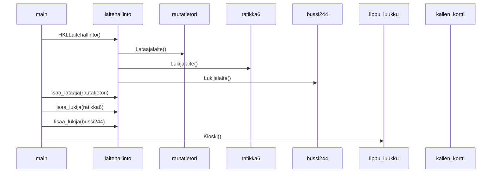

```mermaid

sequenceDiagram
  participant main
  participant laitehallinto
  participant rautatietori
  participant ratikka6
  participant bussi244
  participant lippu_luukku
  participant kallen_kortti
  
    main ->> laitehallinto: HKLLaitehallinto()
    laitehallinto ->> rautatietori: Lataajalaite()
    laitehallinto ->> ratikka6: Lukijalaite()
    laitehallinto ->> bussi244: Lukijalaite()

    main ->> laitehallinto: lisaa_lataaja(rautatietori)
    main ->> laitehallinto: lisaa_lukija(ratikka6)
    main ->> laitehallinto: lisaa_lukija(bussi244)

    main ->> lippu_luukku: Kioski()
 

```
