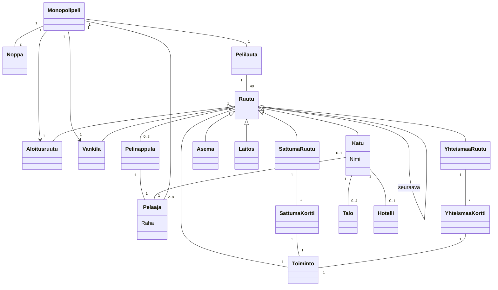

## Monopoli, alustava luokkakaavio

```mermaid
 classDiagram
    Monopolipeli "1" -- "2" Noppa
    Monopolipeli "1" -- "1" Pelilauta
    Monopolipeli "1" --> "1" Aloitusruutu
    Monopolipeli "1" --> "1" Vankila

    Pelilauta "1" -- "40" Ruutu
    Pelinappula "1" -- "1" Pelaaja
    Pelaaja "2..8" -- "1" Monopolipeli

    Ruutu "1" -- "1" Toiminto
    Ruutu "1" -- "1" Ruutu : seuraava
    Ruutu "1" -- "0..8" Pelinappula
    Ruutu <|-- Aloitusruutu
    Ruutu <|-- Vankila
    Ruutu <|-- SattumaRuutu
    SattumaRuutu "1" -- "*" SattumaKortti
    SattumaKortti "1" -- "1" Toiminto
    Ruutu <|-- YhteismaaRuutu
    YhteismaaRuutu "1" -- "*" YhteismaaKortti
    YhteismaaKortti "1" -- "1" Toiminto
    Ruutu <|-- Asema
    Ruutu <|-- Laitos
    Ruutu <|-- Katu
    Katu : Nimi

    Katu "1" -- "0..4" Talo 
    Katu "1" -- "0..1" Hotelli 

    Pelaaja : Raha
    Katu "0..1" -- "1" Pelaaja

```

